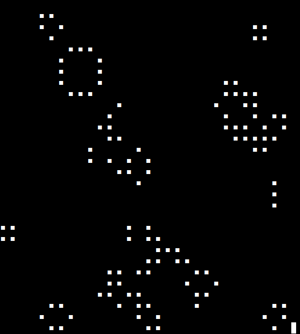

# Conway's Game of Life

Wielowątkowa implementacja Gry w Życie Conwaya za pomocą `pthread`. Interfejs tekstowy korzysta z biblioteki `ncurses`



## Uruchamianie

```sh
make all
./life <liczba wątków>
```